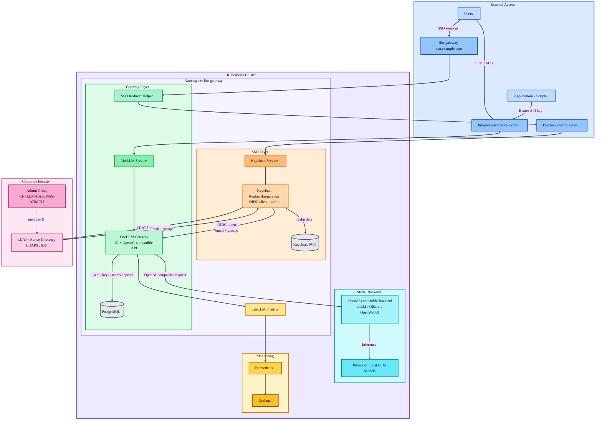

# Helm LLM Gateway SSO POC

An anonymized portfolio-ready Kubernetes/Helm project for deploying an internal LLM Gateway platform with:

- LiteLLM Gateway
- Keycloak SSO
- LDAPS / Active Directory federation
- PostgreSQL persistence
- OpenAI-compatible LLM backend
- Prometheus metrics
- Grafana dashboard import support
- Optional SSO shortcut redirect

This project is intentionally generic. It does **not** contain real company domains, secrets, tokens, internal hostnames, LDAP DNs, certificates, IP addresses, node names, or production values.

---

## Goal

The goal of this project is to demonstrate how an enterprise-style LLM Gateway can be deployed on Kubernetes using Helm.

The platform exposes an OpenAI-compatible API through LiteLLM, authenticates users with Keycloak, federates identities from LDAP/Active Directory through LDAPS, stores LiteLLM state in PostgreSQL, and exposes Prometheus metrics for monitoring.

This repository is designed as a portfolio/lab template, not as a direct copy of any production deployment.

---

## Architecture



---

## Repository layout

```text
helm-llm-gateway-sso-poc/
├── charts/
│   ├── keycloak-ldaps-sso/
│   │   ├── Chart.yaml
│   │   ├── values.yaml
│   │   └── templates/
│   └── litellm-gateway/
│       ├── Chart.yaml
│       ├── values.yaml
│       └── templates/
├── examples/
│   ├── prometheus-scrape.yaml
│   └── values-demo.yaml
├── docs/
│   └── portfolio-notes.md
└── README.md
```

---

## Components

### Keycloak

Keycloak is used as the identity provider.

It provides:

- OIDC login for LiteLLM
- LDAP / Active Directory user federation
- LDAPS connection to a corporate directory
- Group claim mapping for admin/user roles

Default demo realm:

```text
llm-gateway
```

Default demo OIDC client:

```text
litellm
```

Default demo callback:

```text
http://llm-gateway.example.com/sso/callback
```

---

### LiteLLM Gateway

LiteLLM is used as the LLM API gateway.

It provides:

- OpenAI-compatible `/v1/chat/completions`
- Centralized model routing
- Virtual keys
- User and team management
- Spend / token tracking
- Prometheus metrics
- UI for administration

Default demo URL:

```text
http://llm-gateway.example.com
```

Default API base:

```text
http://llm-gateway.example.com/v1
```

---

### PostgreSQL

PostgreSQL stores LiteLLM state:

- users
- teams
- virtual keys
- spend tracking
- configuration
- model metadata

For the portfolio chart, PostgreSQL is deployed as a simple Kubernetes deployment. For production, prefer a managed PostgreSQL service or a proper PostgreSQL operator.

---

### Model backend

The backend is expected to expose an OpenAI-compatible API, for example:

- vLLM
- Ollama behind OpenWebUI
- OpenWebUI API
- another internal OpenAI-compatible gateway

Example anonymized backend:

```yaml
backend:
  apiBase: "https://models.example.com/api"
  apiKey: "CHANGE_ME_BACKEND_API_KEY"
```

---

## Quick start

Create namespace:

```bash
kubectl create namespace llm-gateway --dry-run=client -o yaml | kubectl apply -f -
```

Install Keycloak:

```bash
helm upgrade --install keycloak-ldaps-sso ./charts/keycloak-ldaps-sso -n llm-gateway
```

Install LiteLLM:

```bash
helm upgrade --install litellm-gateway ./charts/litellm-gateway -n llm-gateway
```

Check resources:

```bash
kubectl get pod,svc,pvc -n llm-gateway
```

---

## Default demo URLs

```text
Keycloak:
http://keycloak.example.com

LiteLLM UI:
http://llm-gateway.example.com/ui/

LiteLLM API:
http://llm-gateway.example.com/v1

LiteLLM health:
http://llm-gateway.example.com/health/liveliness

LiteLLM metrics:
http://llm-gateway.example.com/metrics

SSO shortcut:
http://llm-gateway-sso.example.com
```

---

## Main values to change

### Keycloak values

```yaml
publicUrl: "http://keycloak.example.com"

keycloak:
  adminUser: "admin"
  adminPassword: "CHANGE_ME_KEYCLOAK_ADMIN_PASSWORD"
  realm: "llm-gateway"

oidcClient:
  clientId: "litellm"
  clientSecret: "CHANGE_ME_LITELLM_OIDC_CLIENT_SECRET"
  redirectUris:
    - "http://llm-gateway.example.com/sso/callback"
  webOrigins:
    - "http://llm-gateway.example.com"
```

### LDAP values

```yaml
ldap:
  enabled: true
  providerName: "corp-ldaps"
  url: "ldaps://ldap.example.local:636"
  bindDn: "svc-ldap@example.local"
  bindPassword: "CHANGE_ME_LDAP_BIND_PASSWORD"
  usersDn: "OU=Users,DC=example,DC=local"
  usernameAttribute: "mail"
  rdnAttribute: "cn"
  uuidAttribute: "objectGUID"
  customUserSearchFilter: "(&(objectClass=user)(mail=*))"
  adminGroupDn: "CN=LLM-GATEWAY-ADMINS,OU=Groups,DC=example,DC=local"
```

### LiteLLM values

```yaml
public:
  baseUrl: "http://llm-gateway.example.com"
  ssoShortcutUrl: "http://llm-gateway-sso.example.com"

admin:
  masterKey: "sk-change-me-master-key"
  uiUsername: "admin"
  uiPassword: "CHANGE_ME_ADMIN_PASSWORD"

backend:
  apiBase: "https://models.example.com/api"
  apiKey: "CHANGE_ME_BACKEND_API_KEY"
  sslVerify: false
```

---

## Private CA / LDAPS certificates

If the LDAP server uses a certificate signed by a private enterprise CA, Keycloak must trust that CA.

The chart provides a placeholder section:

```yaml
ldapCa:
  enabled: false
  caCrt: ""
```

For a private LDAPS CA, enable it:

```yaml
ldapCa:
  enabled: true
  caCrt: |
    -----BEGIN CERTIFICATE-----
    MIID...
    -----END CERTIFICATE-----
```

The chart mounts the CA in the Keycloak pod and sets:

```text
KC_TRUSTSTORE_PATHS=/etc/x509/ldap-ca/ca.crt
```

This allows Keycloak to validate the LDAPS certificate when connecting to:

```text
ldaps://ldap.example.local:636
```

### Important

Do **not** commit a real company CA directly in a public repository.

For a real deployment, prefer:

- External Secrets
- Sealed Secrets
- SOPS
- a manually created Kubernetes Secret
- a private values file excluded from Git

Example external secret pattern:

```yaml
ldapCa:
  enabled: true
  caCrt: |
    -----BEGIN CERTIFICATE-----
    PLACEHOLDER_ONLY
    -----END CERTIFICATE-----
```

---

## Backend TLS certificates

If the OpenAI-compatible backend uses HTTPS with a private CA, LiteLLM must also trust that CA.

Example backend:

```yaml
backend:
  apiBase: "https://models.example.com/api"
```

For a quick lab or POC, TLS verification can be disabled:

```yaml
backend:
  sslVerify: false
```

This is useful for testing, but it is not the recommended production approach.

For production, keep certificate verification enabled and mount the corporate CA into the LiteLLM pod using one of these environment variables:

```text
REQUESTS_CA_BUNDLE=/etc/ssl/custom-ca/ca.crt
SSL_CERT_FILE=/etc/ssl/custom-ca/ca.crt
```

A production-grade chart could add:

```yaml
backendCa:
  enabled: true
  caCrt: |
    -----BEGIN CERTIFICATE-----
    ...
    -----END CERTIFICATE-----
```

and mount it into the LiteLLM deployment.

---

## SSO flow

The expected SSO flow is:

```text
User
  -> LiteLLM UI
  -> SSO redirect
  -> Keycloak
  -> LDAPS user lookup
  -> OIDC token
  -> LiteLLM session
```

The OIDC client must allow this redirect URI:

```text
http://llm-gateway.example.com/sso/callback
```

Keycloak must return at least:

```text
email
name
groups
```

LiteLLM maps groups to roles using the configured group claim.

Example:

```yaml
sso:
  groupClaim: "groups"
  defaultRole: "internal_user"
  adminGroupDn: "CN=LLM-GATEWAY-ADMINS,OU=Groups,DC=example,DC=local"
```

---

## Optional SSO shortcut

Some LiteLLM versions may not auto-redirect to SSO from the UI login page.

This chart includes an optional SSO redirect helper based on Nginx.

It exposes:

```text
http://llm-gateway-sso.example.com
```

and redirects directly to the Keycloak authorization endpoint.

This is useful for a clean user entry point:

```text
Users open llm-gateway-sso.example.com
-> redirected to Keycloak
-> redirected back to LiteLLM
```

---

## Prometheus metrics

LiteLLM exposes metrics on:

```text
/metrics
```

To enable Prometheus callbacks in LiteLLM config, use:

```yaml
litellm_settings:
  callbacks:
    - prometheus
```

Prometheus scrape example:

```yaml
scrape_configs:
  - job_name: litellm-gateway
    metrics_path: /metrics
    static_configs:
      - targets:
          - litellm-gateway.llm-gateway.svc.cluster.local:4000
```

The chart includes a scrape example ConfigMap.

You can retrieve it with:

```bash
kubectl -n llm-gateway get cm litellm-gateway-prometheus-scrape-example \
  -o jsonpath='{.data.litellm\.yml}'
```

---

## Grafana dashboard

LiteLLM already exposes Prometheus metrics that can be consumed by Grafana.

In many cases, you do not need to build a custom dashboard from scratch. A better portfolio approach is to:

1. enable LiteLLM Prometheus metrics
2. configure Prometheus scraping
3. import an existing LiteLLM Grafana dashboard
4. optionally customize panels for your environment

Useful dashboard categories:

- request rate
- total requests
- total tokens
- prompt tokens
- completion tokens
- estimated spend
- errors
- latency
- model usage
- user / key usage

For a production deployment, dashboards should be versioned as JSON and provisioned with Grafana sidecar ConfigMaps or GitOps.

---

## API test

Generate or use a LiteLLM virtual key, then test:

```bash
export LITELLM_KEY="sk-your-generated-key"

curl -s http://llm-gateway.example.com/v1/chat/completions \
  -H "Authorization: Bearer $LITELLM_KEY" \
  -H "Content-Type: application/json" \
  -d '{
    "model": "demo-model",
    "messages": [
      {
        "role": "user",
        "content": "Reply only with: gateway ok"
      }
    ],
    "stream": false
  }' | jq .
```

Expected result:

```json
{
  "choices": [
    {
      "message": {
        "content": "gateway ok"
      }
    }
  ]
}
```

---

## Reverse proxy / ingress

This portfolio chart uses NodePort to stay simple and easy to test.

For production, prefer Ingress with TLS.

Example public routes:

```text
keycloak.example.com       -> Keycloak service
llm-gateway.example.com    -> LiteLLM service
llm-gateway-sso.example.com -> SSO redirect helper
```

Recommended production features:

- TLS certificates
- HSTS
- secure cookies
- rate limiting
- request size limits
- access logs
- WebSocket support if required
- proper forwarded headers

---

## Security notes

Do not commit:

- real production values
- real API keys
- real LDAP bind passwords
- real Keycloak admin passwords
- real OIDC client secrets
- real CA certificates
- private keys
- internal domains
- internal IP addresses
- internal group names

Use:

- External Secrets
- Sealed Secrets
- SOPS
- Vault
- GitOps with encrypted secrets
- separate `values.local.yaml` excluded from Git

---

## Portfolio safety checklist

Before publishing this repository:

- replace company domains with `example.com`
- replace internal LDAP domains with `example.local`
- replace all secrets with `CHANGE_ME`
- remove real certificates and keys
- remove real node names and IPs
- remove real model names if sensitive
- remove real user/group names
- remove private registry URLs
- remove production values files
- run a final grep check

Example grep check:

```bash
grep -RniE "company|corp|internal-domain|real-domain|BEGIN CERTIFICATE|BEGIN PRIVATE KEY|password|secret|token" .
```

---

## Production improvements

For production usage, improve this template with:

- Ingress instead of NodePort
- TLS everywhere
- External Secrets or Sealed Secrets
- NetworkPolicies
- dedicated PostgreSQL operator or managed PostgreSQL
- PodDisruptionBudgets
- resource requests and limits tuned from real metrics
- readiness and liveness probes validated under load
- backup and restore strategy
- GitOps deployment with Argo CD or Flux
- PrometheusRule alerts
- Grafana dashboard provisioning
- centralized logging with Loki or another log backend

---

## Why this is portfolio-friendly

This project demonstrates real DevOps and platform engineering skills:

- Kubernetes deployment design
- Helm templating
- SSO integration
- LDAPS federation
- API gateway deployment
- secrets separation
- PostgreSQL-backed app deployment
- monitoring and metrics
- production-readiness thinking
- security-conscious anonymization

It is intentionally written as a reusable template and not as a copy of a real internal project.
